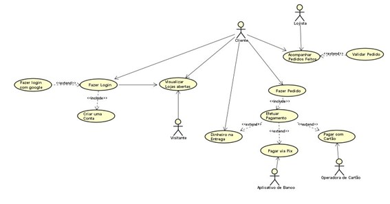
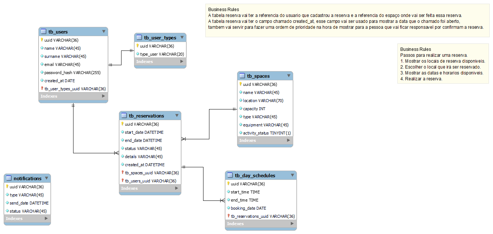

# SMEU - UFPA
Projeto da disciplina de PROJETO INTEGRADO II da UNIVERSIDADE FEDERAL DO PARÁ - UFPA  professor ELTON SARMANHO SIQUEIRA.

Projeto Integrado II: Sistema de Marcação de
Espaços na Universidade

# 1 - PROPOSTA DE TRABALHO
Este documento descreve os requisitos, a modelagem e o processo de desenvolvimento
de um sistema de marcação de espaços na universidade. O objetivo é
permitir que funcionnários possam reservar espaços físicos como salas de estudo,
auditórios e laboratórios de forma eficiente e automatizada.


# 2 - REQUISITOS DO SISTEMA
#### REQUISITOS FUNCIONAIS
- Os usuários devem poder se registrar e fazer login no sistema.
- O sistema deve oferecer uma visão geral dos espaços disponíveis para reserva.
- Os usuários devem poder fazer reservas de espaços para datas e horários específicos.
- O sistema deve enviar confirmações de reserva por e-mail aos usuários.
- Administradores do sistema devem poder adicionar, modificar ou remover espaços disponíveis.

##### TIPOS DE USUÁRIOS DO SISTEMA
- Administrador - vai criar, atualizar, remover e reservar espaços, alem de cadastrar funcionarios.

- Funcionário - vai poder apenas ver espaços disponives e reservar espaços.

- Visitantes - vai poder criar uma conta, visualizar espaços disponiveis e solicitar uma reserva no sistema.

- users teste
- rennedias2003@gmail.com -> admin
- nelma@gmail.com -> employee
- rafael@gmail.com -> user

##### ALGUMAS IMPLEMENTAÇÕES FUTUTRAS
- Quando uma reserva for criada, se passar cinco minutos e o admin não confirmar a reserva, ela será deletada do banco automaticamente, assim o data que foi reservada anteriormente passa a ficar disponivel.

- Assim que as reservas ficarem no passado, elas serão deletas do banco.


#### REQUISITOS NÃO FUNCIONAIS
- O sistema deve ser acessível através de qualquer dispositivo conectado á internet.
- A interface do usuário deve ser intuitiva e fácil de usar.
- As informações de reserva devem ser armazenadas de forma segura.


# 3 - CASOS DE USO 
Este é o modelo entidade relacionamento do sistema de marcação de espaços físicos da UFPA.




# 4 - MODELO ENTIDADE RELACIONAMENTO
Este é o modelo entidade relacionamento do sistema de marcação de espaços físicos da UFPA.



# 🚀 Começando

Essas instruções permitirão que você obtenha uma cópia do projeto em operação na sua máquina local para fins de desenvolvimento e teste.

Consulte **[Implantação](#-implanta%C3%A7%C3%A3o)** para saber como implantar o projeto.

# 📋 Pré-requisitos


Para execultar o software, você precisa ter os seguintes programas instalados em sem computador.
- node js
- vscode

# 🔧 Instalação

Siga o passo-a-passo que informam o que você deve executar para ter um ambiente de desenvolvimento em execução.

Faça o clone desse projeto usando os seguintes comandos do github:

```
git clone https://github.com/renne10dias/NODE-BASICO.git
```

Após clonar o projeto em sua pasta na sua maquina, execulte o seguinte comando:

```
npm run dev
```

O terminal deve mostrar algo parecido com isso.

```
> dominando-nodejs@1.0.0 dev
> nodemon index.js

[nodemon] 3.1.0
[nodemon] to restart at any time, enter `rs`  
[nodemon] watching path(s): *.*
[nodemon] watching extensions: js,mjs,cjs,json
[nodemon] starting `node index.js`
```
PRONTO, o projeto já está em execução.

# ⚙️ Executando os testes

Explicar como executar os testes automatizados para este sistema.

### 🔩 Rotas para acesso a API REST do projeto.

Rotas responsaveis para realizar as funcionalidades do projeto.

GET - Listagem e busca de customers

```
http://localhost:3000/customers/
http://localhost:3000/customers/3
```
POST - Inserção de customers

```
http://localhost:3000/customers
```

PUT - Atualiza o customers

```
http://localhost:3000/customers/1
```

DELETE - Apaga o customers

```
http://localhost:3000/customers/1
```

# 🛠️ Construído com

Ferramentas usadas para a criação desse projeto.

* ***[Node.js®](https://nodejs.org/en)*** - é um ambiente de execução JavaScript gratuito, de código aberto e multiplataforma.
* ***[Typescript®](https://www.typescriptlang.org/)*** - TypeScript é uma linguagem de programação fortemente tipada baseada em JavaScript, oferecendo melhores ferramentas em qualquer escala.
* ***[Express](https://expressjs.com/)*** - Express.js é um framework para Node.js que fornece recursos mínimos para construção de servidores web.
* ***[Prisma](https://www.prisma.io/)*** - O Prisma oferece a melhor experiência para sua equipe trabalhar e interagir com bancos de dados.Até mesmo coisas complexas como pool de conexões, cache e assinaturas de banco de dados em tempo real são muito fáceis com nossos produtos.

# 🛠️ PADRÃO DE PROJETO APLICADO - DESIGN PATTERNS
Padrões de projeto (design patterns) são soluções típicas para problemas comuns em projeto de software. Cada padrão é como uma planta de construção que você pode customizar para resolver um problema de projeto particular em seu código.

Padrões são como um conjunto de ferramentas
para soluções de problemas comuns em design
de software. Eles definem uma linguagem
comum que ajuda sua equipe a se
comunicar mais eficientemente.

## SOLID
O acrônimo ***SOLID*** é um conjunto de princípios de design de código que visam facilitar a manutenção e a evolução do software. Ele foi introduzido por Robert C. Martin em 2000 e é composto por cinco princípios:

- **S** - Single Responsibility Principle (Princípio da Responsabilidade Única)
- **O** - Open/Closed Principle (Princípio do Aberto/Fechado)
- **L** - Liskov Substitution Principle (Princípio da Substituição de Liskov)
- **I** - Interface Segregation Principle (Princípio da Segregação de Interfaces)
- **D** - Dependency Inversion Principle (Princípio da Inversão de Dependências)

  

## MVC

O ***MVC*** é um padrão de arquitetura de software que separa a aplicação em três componentes principais: Model, View e Controller. O objetivo é separar a lógica de negócio da interface do usuário, facilitando a manutenção e a evolução do software.

- **Model** - Representa a camada de dados da aplicação. É responsável por acessar o banco de dados, realizar operações de CRUD e representar os objetos de negócio.

- **View** - Representa a camada de apresentação da aplicação. É responsável por exibir os dados ao usuário e capturar as interações do usuário.

- **Controller** - Representa a camada de controle da aplicação. É responsável por receber as requisições do usuário, chamar os métodos de serviço e retornar a resposta ao usuário.

  

# ✒️ Autores


* **Renne Dias** - *Trabalho Inicial* - [umdesenvolvedor](https://github.com/linkParaPerfil)


# 📄 Licença

Este projeto está sob a licença (projetosdiasdev) - visite o [SITE](https://projetosdiasdev.com).

# 🎁 Expressões de gratidão

* Conte a outras pessoas sobre este projeto 📢;
* Convide alguém da equipe para uma cerveja 🍺;
* Um agradecimento publicamente 🫂;
* etc.


---
⌨️ com ❤️ por [Renne Dias](https://github.com/renne10dias) 😊
